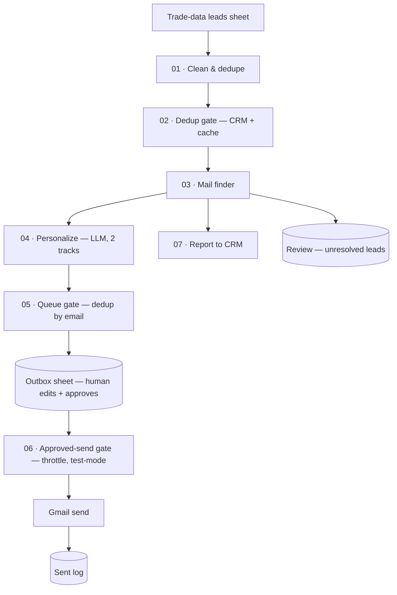

# Autonomous Lead-Generation & Cold-Outreach Engine

A zero-marginal-cost B2B lead engine that turns raw **import/export trade data** into
**verified contacts** and **personalized, human-approved cold emails**, then **follows
up on no-replies at an escalating cadence** — built on
[Activepieces](https://www.activepieces.com/) (low-code orchestration) with a set of
custom JavaScript pipeline steps.

I designed and built the whole system end to end:

- **Service A** — discovery → contact-finding → personalization → approval → send → CRM sync.
- **Service C** — CRM-driven follow-up engine: nudges mailed-but-silent contacts on a
  4-touch schedule, with the same human-approval gate, and stops the moment someone replies.

Client details are anonymized; the engineering is unchanged.

---

## What it does

Given a sheet of messy trade-data rows (company name, HS code, shipment origin,
destination, product description), the engine:

1. **Cleans & de-duplicates** rows into unique buyer companies.
2. **Skips anything already handled** (checked against a CRM + local cache) *before*
   spending any paid credits.
3. **Finds a mailable contact** per company through a cost-ordered cascade — free
   methods first, paid providers only as a fallback.
4. **Writes a personalized email** with an LLM (two pitch tracks, configurable prompt).
5. **Queues drafts for human approval** in a sheet, then **sends** the approved ones
   on a schedule (with throttling, test-mode, and deliverability safeguards).
6. **Logs** every send and **syncs** companies/contacts back to the CRM.

The design goal: **maximum coverage at near-zero cost**, failing *safe* — it parks
uncertain leads for review rather than emailing the wrong company.

---

## Architecture



### The mail finder (the core of the system)

One company in → one graded, mailable address out, cheapest path first:

```
1. SEED      provided email passes syntax + MX gate        → A_high   (0 credits)
2. RESOLVE   domain via search cascade, then corroborate   (free-first)
             seed website → SearXNG → Brave → Serper → Tavily → Clearbit
             corroborate = fetch homepage, match company name tokens + MX
3. SCRAPE    /contact /about /team /impressum … + mailto:   → A_high   (0 credits)
             pick order: procurement@ / purchasing@ > sales@ > info@
4. FIND      people finders  Hunter → Apollo → Snov        (budgeted)
5. VERIFY    inferred emails only  Reoon → ZeroBounce       (budget-guarded)
             valid → B_medium   |   catch-all / unverified → C_hold (review)
```

Every stage is **budget-guarded** and **corroborated**, so credits are never spent on a
company that resolves for free, and a confidently-wrong domain (a common failure on
generic importer names) is rejected rather than emailed.

### Follow-up engine (Service C)

A separate pair of flows handles the follow-up loop, reusing the same
draft → approve → send shape:

```
C-draft : pull mailed contacts from the CRM
          keep those due a follow-up (touch count < 4, gap elapsed, not replied)
          write a personalized nudge per contact → Follow-up Outbox
C-send  : send the rows you approved → log to Follow-up Sent
          write the new touch count back to the CRM → delete sent rows
```

- **Escalating cadence** — up to 4 touches, spaced over time, tracked per contact.
- **State lives in the CRM** (`Touch_Count`, `Last_Touch_At`, `Follow_Up_Status`),
  so follow-ups survive across runs and both services share one source of truth.
- **Stops on reply** — any `replied / bounced / unsubscribed / opted_out` status
  removes a contact from the queue, so no one who answered gets nudged again.

See [`docs/SERVICE-C.md`](docs/SERVICE-C.md) for the runbook.

---

## Engineering highlights

- **Cost-ordered cascade** — seed check and website scraping resolve most contacts for
  **zero credits**; paid APIs (Hunter/Apollo/Snov, Reoon/ZeroBounce) are a budgeted last
  resort, each capped per run.
- **Corroboration gate** — a candidate domain is only accepted if the company's name
  tokens appear on its homepage *and* it has MX, which kills the "generic name → wrong
  brand / trade-directory site" failure mode.
- **Confidence grading** — every contact is tagged `A_high` / `B_medium` / `C_hold`;
  only A/B auto-send, C is parked for a human.
- **Deliverability-aware** — per-run and daily send caps, dedup by email across the
  whole history, a test-mode that redirects every email to your own inbox, and sends
  from a single warmed mailbox so the CRM can read them back.
- **Human-in-the-loop by design** — drafts land in an editable Outbox sheet; nothing
  sends until a person marks it approved. Sent rows self-clean from the Outbox.
- **Idempotent CRM sync** — reports companies + contacts to a CRM via a batched,
  retry-safe ingest; never double-counts sends.
- **Loopless orchestration** — the data steps iterate internally in code and bulk-write
  rows, keeping the Activepieces flow flat and debuggable.

---

## Tech

| Layer | Choice |
|---|---|
| Orchestration | Activepieces (scheduled flow, code steps, Google Sheets, Gmail) |
| Language | JavaScript (ES modules, `fetch`-based, no heavy deps) |
| Domain resolution | SearXNG / Brave / Serper / Tavily / Clearbit (free-tier) |
| Contact finding | website scraping + Hunter / Apollo / Snov |
| Email verification | Reoon / ZeroBounce (budget-guarded) |
| Personalization | LLM over an OpenAI-compatible endpoint (configurable prompt) |
| Store / UI | Google Sheets (Leads · Found · Outbox · Sent · Review) |

All provider keys are **optional inputs** — with none set, the engine still runs on the
free backbone (search-resolve + scrape + seed emails).

---

## Repository layout

```
pipeline/                    Service A — discover → send (code steps, in flow order)
  01-clean-dedupe-merge.js   trade-data rows → unique buyer companies
  02-dedup-gate.js           skip companies already in the CRM / cache
  03-mail-finder.js          seed → resolve → scrape → find → verify  (core)
  04-personalize.js          LLM cold-email writer, two pitch tracks
  05-queue-gate.js           dedup by email, throttle, → Outbox rows
  06-approved-gate.js        release approved rows, throttle, test-mode
  07-report-crm.js           batched, idempotent CRM ingest
followup/                    Service C — escalating follow-ups
  c1-followup-scan.js        find contacts due a follow-up (CRM-driven)
  c2-approved-send-gate.js   release + send approved follow-ups
  c3-crm-touch-update.js     write touch count / last-touch back to the CRM
flows/                       importable Activepieces exports (sanitized)
  flow-A-discover-and-send.json
  flow-C-followups-and-replies.json
  flow-C-send.json
docs/
  SETUP.md                   how to deploy and configure
  SERVICE-C.md               follow-up engine runbook
```

See [`docs/SETUP.md`](docs/SETUP.md) to run it.

## Note

Built as a real client project; all company names, endpoints, credentials, and personal
data have been replaced with placeholders. Shared as a portfolio piece.
